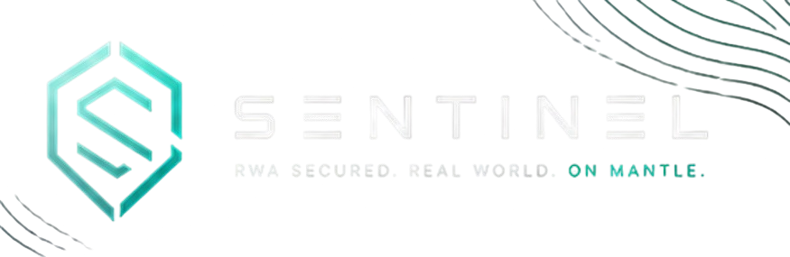
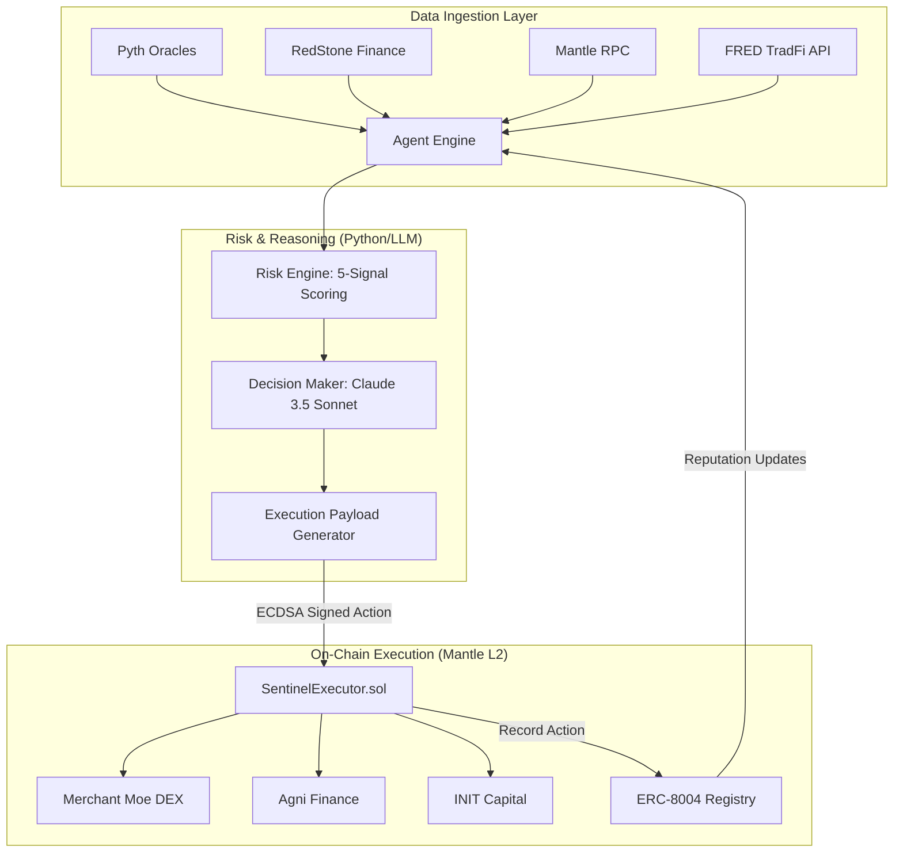

<p align="center">
  
</p>

<p align="center">
  <strong>Autonomous On-Chain Risk Guardian for Real-World Assets</strong><br />
  <em>Off-chain Intelligence ↔ On-chain Protection ↔ Verifiable Reputation</em>
</p>

<p align="center">
  
  
  
  
  
  
</p>

<p align="center">
  <a href="https://sentinel-mantle-rwa.vercel.app"><strong>Live Dashboard & Demo »</strong></a>
</p>

---

## 🏛️ System Architecture

SENTINEL operates as a hybrid autonomous system, combining the reasoning capabilities of Large Language Models (LLMs) with the immutable execution and verification of the Mantle Network.




## 🛡️ Core Value Proposition

In fragmented RWA markets, systemic risks (de-pegs, liquidity crunches, macro shifts) materialize faster than human intervention can respond. **SENTINEL** bridges this gap by providing:

1.  **Deterministic Risk Scoring**: A multi-signal engine that quantifies risk from 0–100 based on live oracle and chain data.
2.  **Autonomous Mitigation**: Programmatic execution of exposure reduction (25%/50%/100%) or hedging without human-in-the-loop latency.
3.  **ERC-8004 Identity**: Every agent action is recorded on-chain, building a verifiable reputation score that determines the agent's autonomous capital limits.

---

## 📊 Risk Engine & Decision Matrix

The system computes a composite risk score using five weighted vectors:

| Signal | Weight | Logic |
| :--- | :--- | :--- |
| **De-peg Risk** | 35% | $|\text{Price} - \text{Peg Target}|$ deviation analysis. |
| **Liquidity Risk** | 25% | Pool depth (TVL) vs. slippage for portfolio exit size. |
| **Correlation** | 20% | Pearson correlation coefficient across Mantle RWA basket. |
| **Volatility** | 10% | 24h/7d historical vs. implied volatility spikes. |
| **TradFi Macro** | 10% | T-Bill yield spreads (via FRED) vs. DeFi native yields. |

### Execution Thresholds

| Risk Score | Status | Required Action |
| :--- | :--- | :--- |
| `0–30` | **Stable** | `HOLD` / Monitoring only. |
| `31–50` | **Caution** | `REDUCE_25` - Minor exposure reduction. |
| `51–70` | **Warning** | `REDUCE_50` - Significant de-risking. |
| `71–85` | **Danger** | `FULL_EXIT` or `HEDGE` - Immediate protection. |
| `86–100` | **Critical** | `FULL_EXIT` - Emergency shutdown. |

---

## 🏗️ Technical Stack & Standard

### Smart Contracts (Solidity 0.8.24)
- **`SentinelExecutor.sol`**: The "hands" of the agent. Verifies EIP-712 style signatures from the authorized AI agent before executing protocol interactions.
- **`ERC8004Registry.sol`**: The "brain" of the agent's on-chain identity. Tracks reputation and enforces trust tiers.

### AI Engine (Python 3.11)
- **LangChain & Claude 3.5**: Advanced reasoning for complex risk scenarios.
- **Web3.py**: Low-level chain interaction and signature generation.

### Security Invariants
- **ECDSA Verification**: Only the designated agent signer can trigger execution.
- **Cooldown enforcement**: 300-second (5 min) minimum interval between state-modifying actions per asset.
- **Slippage Protection**: Hardcoded 1% max slippage for all emergency swaps.

---

## 🚀 Quick Start for Developers

### Prerequisites
- Node.js v20+ & Bun/NPM
- Python 3.11+
- [Mantle Sepolia RPC URL](https://rpc.sepolia.mantle.xyz)

### Installation

1. **Clone & Install Dependencies**
   ```bash
   git clone https://github.com/your-org/sentinel-rwa
   cd sentinel-rwa
   npm install
   pip install -r requirements.txt
   ```

2. **Environment Configuration**
   ```bash
   cp .env.example .env
   # Populate AGENT_PRIVATE_KEY, RPC_URL, and Contract Addresses
   ```

3. **Deploy & Verify (Mantle Sepolia)**
   ```bash
   npx hardhat run scripts/deploy.ts --network mantleTestnet
   ```

4. **Initialize Monitoring Loop**
   ```bash
   python -m agents
   ```

5. **Run Dashboard**
   ```bash
   cd frontend
   npm install
   npm run dev            # Local: http://localhost:3000
   ```
   Live Production: [sentinel-mantle-rwa.vercel.app](https://sentinel-mantle-rwa.vercel.app)

---

## 🔗 Contract Registry (Mantle Testnet Sepolia)

| Contract | Address |
| :--- | :--- |
| **ERC8004Registry** | `0xa6446C060e93A91b00dA94135d784704F27558eb` |
| **SentinelExecutor** | `0xa3c740c8F64eB59c21743792c10aA7E6e1734160` |
| **Agent ID** | `0x5252...2ede` |

---

## Contributors
- [Rusty](https://github.com/RustyRustacle)
- [Heika](https://github.com/aryahaikakusuma)

## 📜 License & Disclaimer

This project is licensed under the MIT License. 

**Disclaimer**: *SENTINEL is an experimental autonomous risk management system built for the Mantle Turing Test Hackathon. Use in production environments with real capital involves significant risk. The authors are not responsible for any financial losses incurred through the use of this software.*

<p align="center">
  Built with 🛡️ for <strong>Mantle Turing Test Hackathon 2026</strong>
</p>
